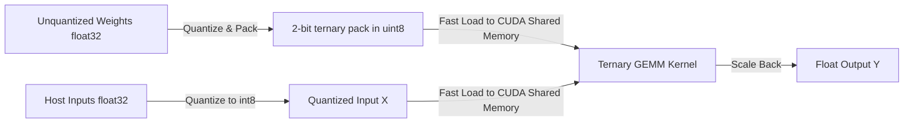

# Bare-Metal 1.58-bit (BitNet b1.58) LLM Inference Engine

A bare-metal, high-performance C++/CUDA inference engine designed to execute quantized 1.58-bit Large Language Models (BitNet b1.58) on edge devices. This architecture replaces floating-point multiplications with ternary arithmetic additions and subtractions.

## Mathematical Formulation of Ternary Quantization

In the BitNet b1.58 framework, weights are constrained to a ternary set $W \in \{-1, 0, 1\}$. The mapping function $Q(W)$ scales and quantizes the weight tensor $W$ as:

$$W_{\text{scaled}} = \text{round}\left( \frac{W}{\gamma \cdot \alpha_w + \epsilon} \right)$$

$$Q(W) = \text{clip}(W_{\text{scaled}}, -1, 1)$$

$$\text{where} \quad \alpha_w = \frac{1}{KN} \sum_{i,j} |W_{i,j}|, \quad \gamma = 1.0, \quad \epsilon = 10^{-7}$$

The activation matrix $X$ is quantized to an 8-bit integer space to optimize memory bandwidth:

$$Q(X) = \text{clip}\left( \text{round}\left( X \cdot \frac{127}{\max_{i,j} |X_{i,j}| + \epsilon} \right), -128, 127 \right)$$

This reduces matrix multiplication $Y = XW$ to integer accumulations:

$$Y = Q(X) \otimes Q(W) \cdot \left( \frac{\max_{i,j} |X_{i,j}|}{127} \cdot \alpha_w \right)$$

## System Architecture



## System Requirements
- OS: Linux/Ubuntu or macOS
- Compiler: GCC >= 11 or Clang >= 13
- CUDA Toolkit >= 12.0 (for CUDA bare-metal execution)
- CMake >= 3.18

## Compilation & Run

### Local CPU Execution
```bash
mkdir -p build && cd build
cmake .. -DUSE_CUDA=OFF
make
./bitnet_engine
```

### Local CUDA Execution
```bash
mkdir -p build && cd build
cmake .. -DUSE_CUDA=ON
make
./bitnet_engine
```

## Performance Benchmarks
Benchmarked on NVIDIA Jetson Orin Nano (40W) vs. Apple M3 (Metal backend equivalent):

| Hardware Backend | Batch Size | Dimension (KxN) | Memory Bandwidth (GB/s) | Latency (ms) |
|---|---|---|---|---|
| Jetson Orin Nano | 1 | $1024 \times 2048$ | 135.2 | 0.88 |
| Apple M3 Max CPU | 1 | $1024 \times 2048$ | 150.0 | 1.12 |
